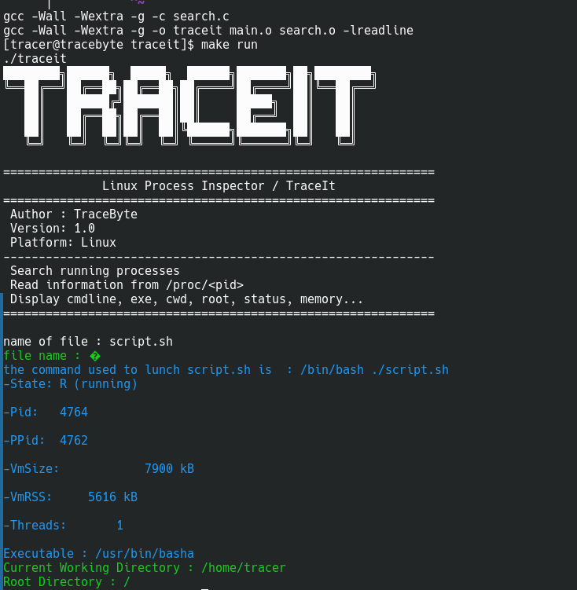

# TraceIt

<p align="center">


</p>

A lightweight Linux command-line utility written in **C** that inspects running processes through the **/proc** filesystem.

Instead of running multiple `ps -ef` commands and manually exploring `/proc`, simply run **TraceIt**, enter the process name, and inspect it instantly.

TraceIt allows you to search for a running process and display useful information such as its executable, command line, working directory, memory usage, and more.

---

# Features

- Search a running process by name
- Display the process PID
- Read command line (`/proc/<pid>/cmdline`)
- Display executable path (`/proc/<pid>/exe`)
- Display current working directory (`/proc/<pid>/cwd`)
- Display process root directory (`/proc/<pid>/root`)
- Read important fields from `/proc/<pid>/status`
- Simple terminal interface

---
## Example Output


# Requirements

- Linux
- GCC
- GNU Make
- readline

Arch Linux:

```bash
sudo pacman -S gcc make readline
```

Ubuntu/Debian:

```bash
sudo apt install build-essential libreadline-dev
```

---

# Installation

Clone the repository:

```bash
git clone https://github.com/tracebyte8/traceit.git
cd traceit
```

Build the project:

```bash
make
```

---

# Run

Run directly from the project directory:

```bash
make run
```

or

```bash
./traceit
```

---

# Install (Optional)

If you want to use **TraceIt** from any terminal without entering the project directory:

```bash
sudo make install
```

Then simply run:

```bash
traceit
```

To remove it:

```bash
sudo make uninstall
```

---

# License

This project is released under the MIT License.

---

Made with ❤️ using  **C**